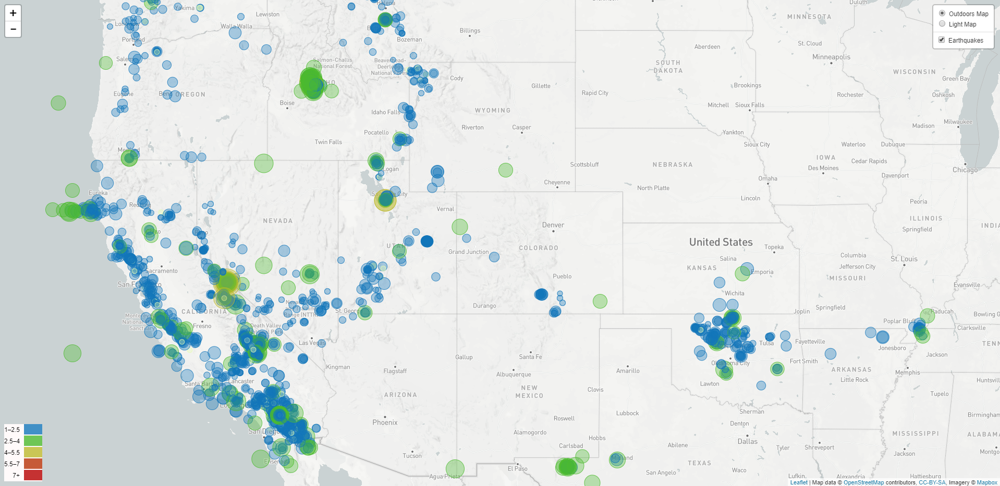
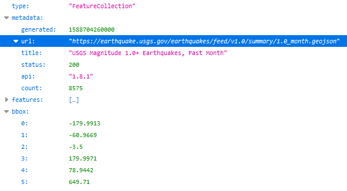
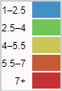

# 
Visualizing USGS Earthquake Data with Leaflet

## Background

  

The United States Geological Survey (USGS) is responsible for providing scientific data about natural hazards, the health of our ecosystems and environment; and the impacts of climate and land-use change. The have some of the top scientists in the world who develop new methods and tools to supply timely, relevant, and useful information about the Earth and its processes.

In this project, I want to build a new set of tools that will visualize USGS earthquake data. They collect a massive amount of data from all over the world each day and a robust set of vizzes help tell important stories from their data collected. Important policy and funding decisions that impact the public's health and safety use this data.

## Setup up Github repo to oraganize plots, code, and date collected from the USGS data

1. I created a new GitHub repository for this project called `leaflet-challenge`.
2. I cloned this new repository to my computer.
3. Inside my local git repository, I created a directory for this Leaflet challenge.
4. This project utilizes both **html** and **Javascript**.
5. Pushed the above changes to GitHub.

## Project Documentation

### 1. **Select the USGS data feed to collect**
I selected data collection for the past 30 days on earthquakes with a 1.0+ magnitude.

  

   

### 2. **Collect the USGS data set using an API**

  

The USGS provides earthquake data in a number of different formats, updated every 5 minutes at

[USGS Geo JSON Feed](https://earthquake.usgs.gov/earthquakes/feed/v1.0/geojson.php). When you click on a data set, for example 'All Earthquakes from the Past 30 Days', you will be given a JSON representation of that data. I used the URL of this JSON to pull in the data for my visualization.

### 3. **Visualize the Data**

I created a map using Leaflet that plots all of the earthquakes from the last 30 days with a magnitude of 1.0+ based on the longitude and latitude of the earthquake.

* The data markers reflect the magnitude of the earthquake in their size and color.
* Earthquakes with lower magnitudes appear smaller and in a blue or green color.
* Earthquakes with higher magnitudes appear larger and in a orange or red color.
* When clicking on a specific earthquake, the following additional information is provided:
   * The earthquake's location to the nearest city.
   * What time the earthquake occured (with GMT and EDT).
   * The magnitude of the earthquake.
* The legends provides a range of magnitude with a color:

# 
  

### 4. **Upload to GitHub Pages**

The final step was to upload this project to **[GitHubPages](https://davis1776.github.io/2020-04-Leaflet-Challenge/)** to create a live site.

- - -
## Tools used

* Javascript
* HTML
* Json
* Leaflet
* GitHub and GitHub Pages

## Author

* **Michael Davis** - **[Davis1776](https://github.com/Davis1776)**

## Acknowledgments

* Data Source: [United States Geological Survey (USGS)]()
* [JSON](https://www.json.org/json-en.html) documentation was used in collecting the data.
* [Leaflet](https://leafletjs.com/) documenation was used in building the map.
* [Butler University Data Analytics and Visualization Executive Education program](https://www.butler.edu/executive-education) and instructors for assistance.
* Hat tip to Triology Education Services for providing the challenge guidelines.

## Copyright
Michael Davis © 2020. All Rights Reserved.